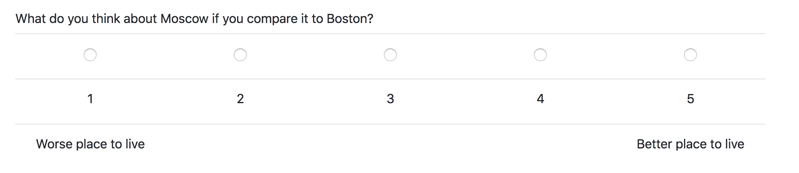

# An example of Table Radio widget

This code provides a widget to render a field to let the user choose between a set 
of choices (rendered as a set of radio buttons) with one extra line - on top or 
on the bottom (or both).


## Installation

1. Copy  `widgets.py` to your app folder (where `models.py` and
'pages.py` are located).
2. Copy `templates/widgets` folder to a `templates` folder of your app.
3. In your `models.py` use `TableRadio` widget in your field declaration:

```python

from .widgets import TableRadio


class Player(BasePlayer):
    s1 = models.IntegerField(
        label='What do you think about Moscow if you compare it to Boston?',
        choices=[1, 2, 3, 4, 5, ],
        widget=TableRadio(bottom_row=['Worse place to live', 'Better place to live '], )
    )
``` 


## Options
You can define two extra parameters:

* `top_row`: that changes how the 'Other' option look like. 


* `bottom_row`: that changes how that marker that is added to the
 


* by default the widget looks like that:


 

